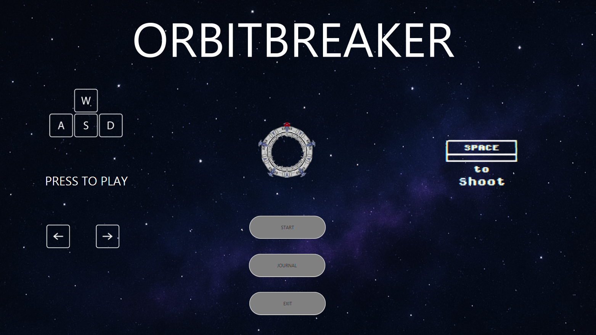
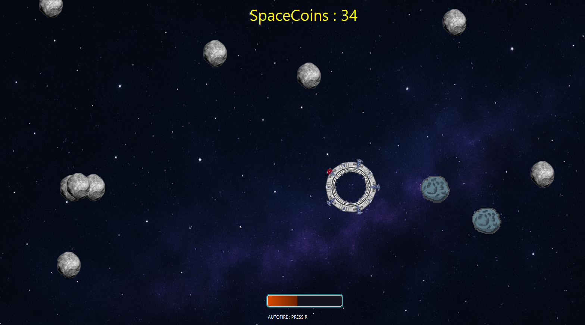

# Asteroids Game

## Requirements to Run the Game

1. **Java 17**
   - Download and install Java 17 (JDK or JRE) from:
   - Oracle JDK: https://www.oracle.com/java/technologies/downloads/#java17
   - OR OpenJDK: https://adoptium.net/ (Choose version 17)

2. **JavaFX SDK 17.0.9**
   - Download JavaFX Windows SDK from: https://gluonhq.com/products/javafx/
   - Extract the downloaded zip file to a location on your computer
   - Remember where you extracted it (e.g., `C:\javafx-sdk-17.0.9`)

## Troubleshooting

If you get any of these errors:
- "Error: JavaFX runtime components are missing"
- "Module javafx.controls not found"
- "Module javafx.fxml not found"

Make sure:
1. You have installed JavaFX SDK
2. The path to JavaFX lib folder is correct in your command/batch file
3. You're using Java 17 (check with `java -version` in command prompt)

## Game Controls

[Add your game controls here]

## About the Game

[Add description of your game here]

# Asteroids-Inspired Space Shooter

A modern take on the classic Asteroids game, built with JavaFX. This is not a direct clone, but rather an inspired minigame that adds unique mechanics and features.

## Features

- **Smooth Player Controls**
  - WASD keys for movement
  - Arrow keys for rotation
  - Space bar for shooting
  - R key to toggle auto-fire mode

- **Dynamic Asteroid System**
  - Small asteroids: Fast but less damaging
  - Big asteroids: Slower but deal massive damage
  - Special healing asteroids (rare spawn) that restore player health

- **Combat Mechanics**
  - Health system with visual health bar
  - Points system for destroying asteroids
  - Multiple active bullets with despawn timer
  - Collision detection system

- **Visual Effects**
  - Modern UI with animated title
  - Particle effects for projectiles
  - Death animation with explosion effect

## Screenshots

  
  
<em>Start Screen with Animated Title</em>

  
  
  
<em>Gameplay Screenshot showing Combat and Asteroids</em>

## Controls

- **Movement**
  - W: Move forward
  - S: Move backward
  - A: Move left
  - D: Move right
  
- **Combat**
  - LEFT ARROW: Rotate counter-clockwise
  - RIGHT ARROW: Rotate clockwise
  - SPACE: Fire projectile
  - R: Toggle auto-fire mode

## Technical Details

- Built with JavaFX
- Object-oriented design with inheritance for different asteroid types
- Efficient collision detection system
- Dynamic difficulty scaling
- Particle system for visual effects

## Development

This is a personal project created for learning and entertainment purposes. The game features custom mechanics while maintaining the spirit of the classic Asteroids game.

